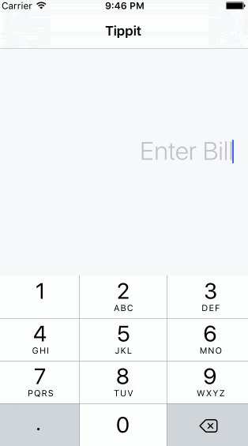

# Pre-work - *Tippit*

**Tippit** is a tip calculator application for iOS.

Submitted by: **Nicholas Wallen**

Time spent: **2** hours spent in total

## User Stories

The following **required** functionality is complete:
* [X] User can enter a bill amount, choose a tip percentage, and see the tip and total values.

The following **optional** features are implemented:
* [X] Custom font
* [X] UI animations
* [X] Making sure the keyboard is always visible and the bill amount is always the first responder. This way the user doesn't have to tap anywhere to use this app. Just launch the app and start typing.

The following **additional** features are implemented:
* [X] Add helptext to bill field.
* [X] Apply currency formatting to bill, tip and total amounts.

## Video Walkthrough 

Here's a walkthrough of implemented user stories:

GIF created with [LiceCap](http://www.cockos.com/licecap/).

## Notes

Xcode errors are really hard to understand — I had a few instances in which the project would not build because I changed an outlet variable name in code, but the storyboard still had a reference to the old variable (I suppose?). 

## License

    Copyright 2016 Nicholas Wallen

    Licensed under the Apache License, Version 2.0 (the "License");
    you may not use this file except in compliance with the License.
    You may obtain a copy of the License at

        http://www.apache.org/licenses/LICENSE-2.0

    Unless required by applicable law or agreed to in writing, software
    distributed under the License is distributed on an "AS IS" BASIS,
    WITHOUT WARRANTIES OR CONDITIONS OF ANY KIND, either express or implied.
    See the License for the specific language governing permissions and
    limitations under the License.
